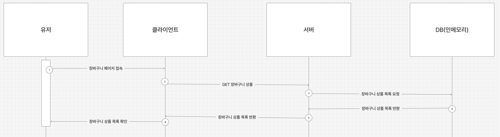
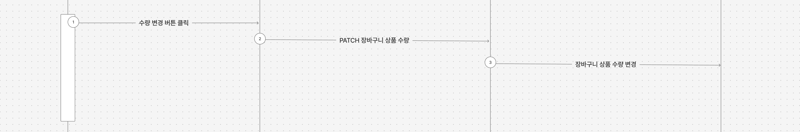
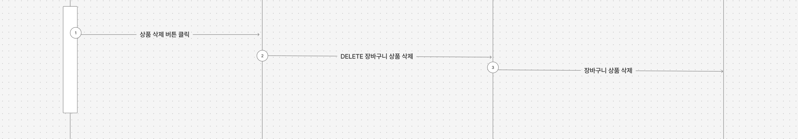
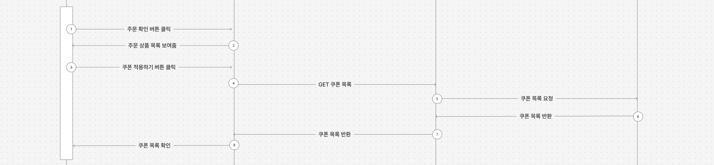
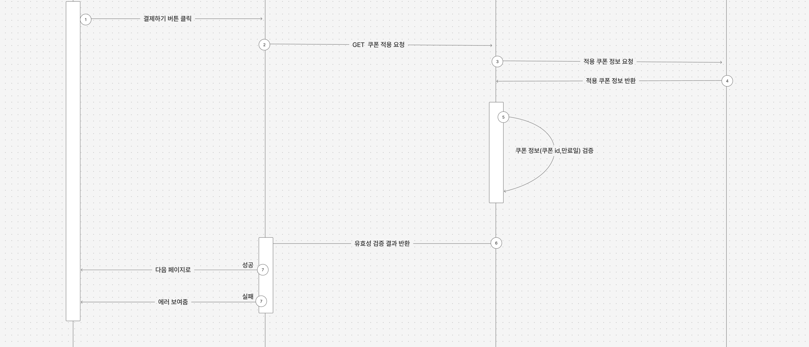
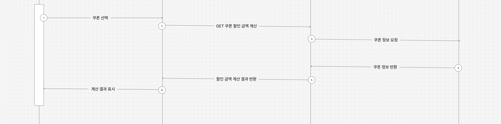
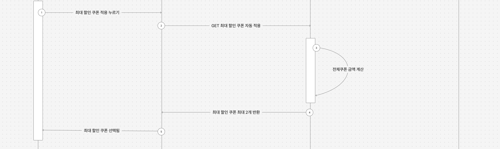
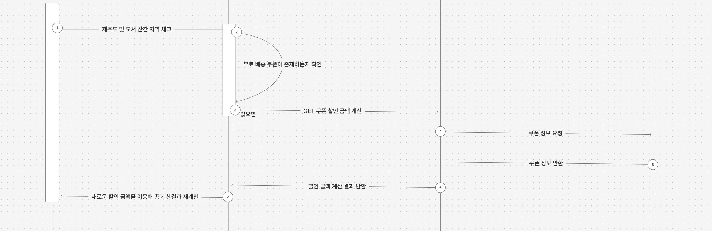

### 장바구니 페이지에 들어와서 상품정보를 확인

### 상품 수량 변경

### 장바구니에서 상품 삭제

### 쿠폰 목록 모달에서 쿠폰목록을 조회

#### 쿠폰 적용하기 버튼이 쿠폰 목록 모달 Open 버튼

### 결제하기 버튼 클릭 시 쿠폰 검증

### 쿠폰목록에서 쿠폰 선택 시 하단 버튼에 총 할인 금액 표시

### 최대 할인 쿠폰 자동적용 버튼 클릭

### 제주도 및 도서산간 체크박스 체크 시

